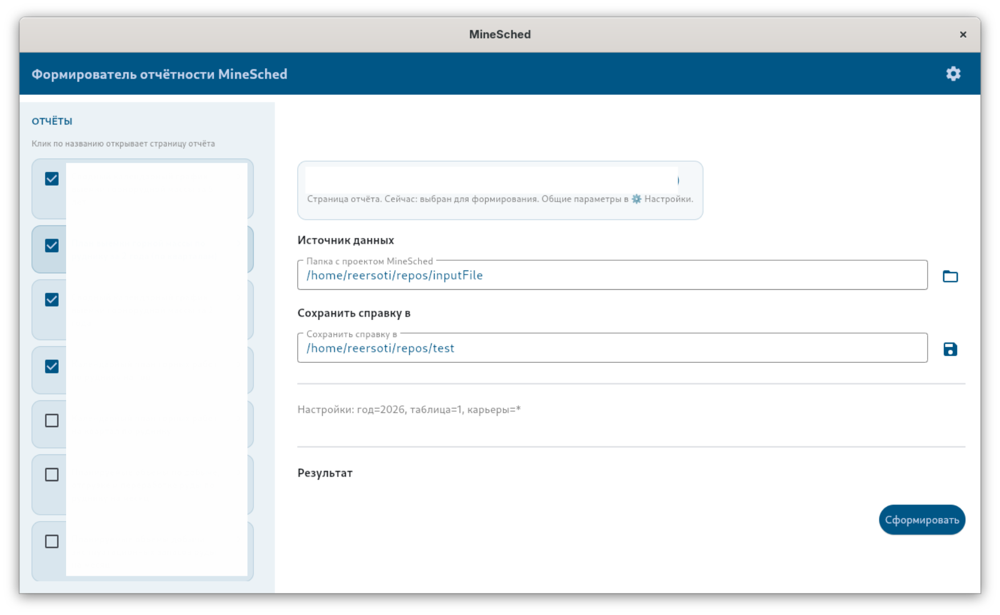
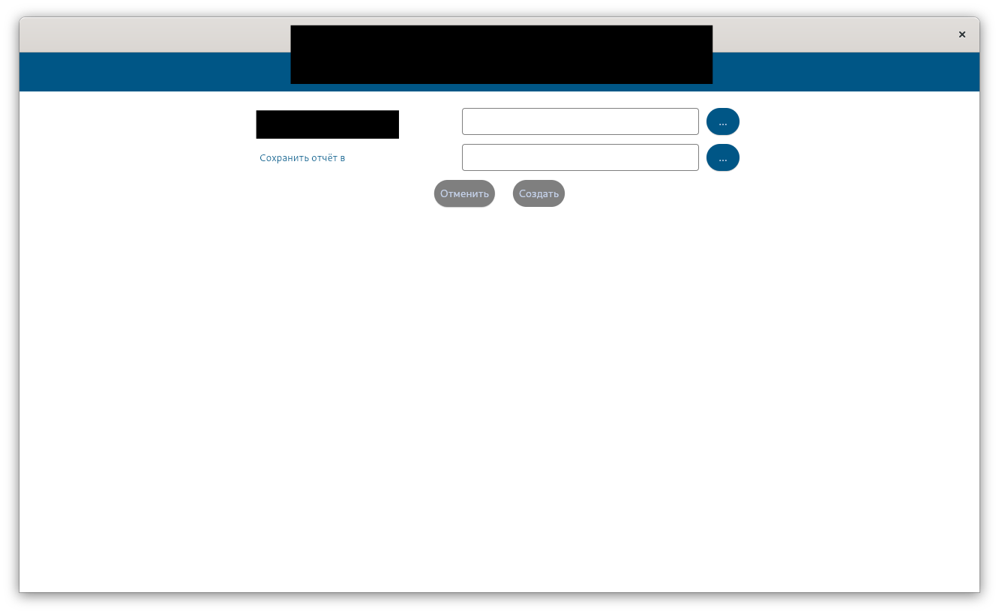
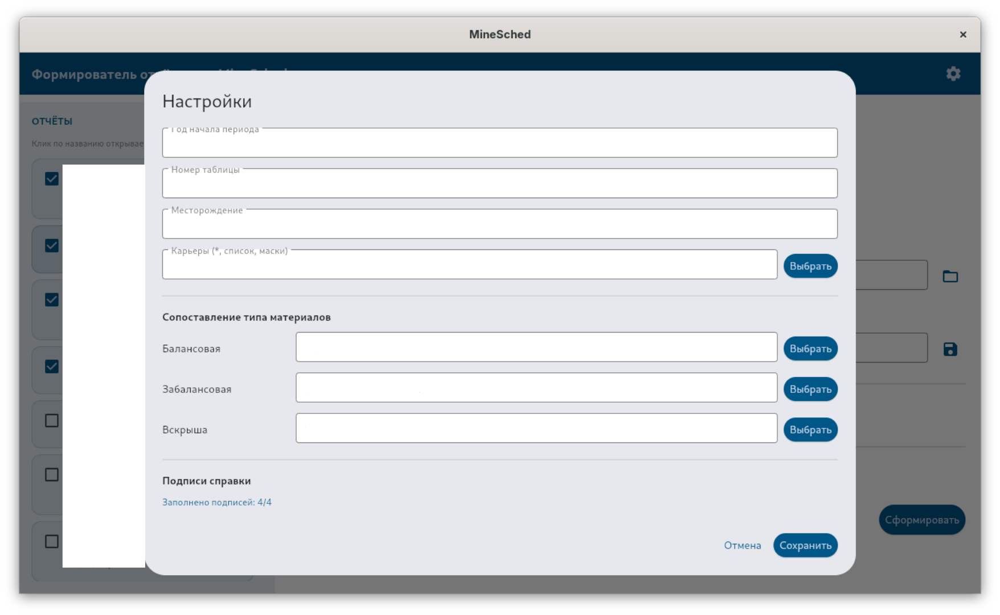

# Reporting Automation Tool

Desktop application for automating internal reporting workflows using **Python**, **Flet**, **Pandas**, and **OpenPyXL**.

> The production source code is private because the project was developed for internal commercial use.
> This repository is a public showcase of the project, its architecture, and implementation approach without exposing proprietary code or data.

---

## Overview

This project was built to reduce manual work in recurring internal reporting processes.

The application provides a desktop interface for selecting source files, configuring report parameters, validating input, and generating Excel reports from templates.

The solution focuses on:

- CSV data processing
- Excel report generation
- desktop UI for non-technical users
- validation and error handling
- modular project structure for multiple report types

---

## Problem

Before automation, report preparation required repetitive manual work:

- opening and checking source files
- extracting required values
- transforming data into report-ready format
- filling Excel templates manually
- validating results before delivery

This process was time-consuming, error-prone, and inconvenient for repeated internal use.

---

## Solution

I developed a desktop application that automates the reporting flow:

- reads and processes source CSV data
- applies report-specific calculations and transformations
- fills Excel templates using predefined placeholders and formatting logic
- saves generated reports with structured output naming
- provides a user-friendly desktop UI for configuration and execution
- handles common input issues and invalid file states

---

## My Contribution

I was responsible for:

- application architecture
- UI implementation
- data processing pipeline
- Excel generation logic
- validation and error handling

---

## Tech Stack

- **Python**
- **Flet** — desktop UI
- **Pandas** — tabular data processing
- **OpenPyXL** — Excel generation and template handling

---

## Key Features

- Desktop interface for report generation
- Input file and output directory selection
- Configurable report parameters
- Validation of required inputs before execution
- Excel report generation from templates
- Modular handling of different report types
- Friendly error messages for common user mistakes
- Persistent settings for repeated use
- Smoke-test mode for quick validation without full UI flow

---

## Architecture

The project was structured into separate layers instead of keeping all logic in one script.

### Main logical parts

- **UI layer**  
  Handles user interaction, input forms, file selection, validation messages, and report execution flow.

- **Parsing layer**  
  Reads and prepares source data from CSV files.

- **Calculation layer**  
  Applies report-specific transformations and calculation rules.

- **Excel layer**  
  Generates final `.xlsx` files using templates, formatting, placeholders, and sheet operations.

- **Report registry / configuration layer**  
  Makes it easier to support multiple report types in a scalable way.

### Simplified flow

```text
User input -> validation -> CSV parsing -> data transformation -> Excel generation -> output file
```

---

## Example Workflow

A user launches the desktop application and:

1. selects source data files;
2. chooses output location;
3. sets report parameters;
4. runs report generation;
5. receives a ready-to-use Excel report.

This reduces repetitive manual work and makes the reporting process more consistent.

---

## Engineering Decisions

Some implementation choices that were important in this project:

- separating UI logic from data processing and Excel generation;
- using **Pandas** for data manipulation and **OpenPyXL** for final Excel output;
- keeping report generation modular for future extension;
- adding validation and user-facing error messages instead of failing silently;
- supporting repeated daily or periodic usage through saved settings.

---

## Challenges

Some non-trivial parts of the project included:

- working with Excel templates in a predictable way;
- handling incomplete or invalid source data;
- keeping the UI simple for repeated internal usage;
- separating report-specific logic from shared application behavior;
- making the tool stable enough for real usage rather than just a demo.

---

## Screenshots

### Main Window


### Secondary Window


### Report Configuration


---

## Public Repository Scope

This repository does **not** include:

- production source code
- internal business logic details
- real client data
- private report templates
- sensitive naming or internal configuration

It is intended to present the project as a professional case study without exposing proprietary assets.

---

## What I Learned

Through this project, I gained practical experience in:

- building a desktop automation tool for a real reporting workflow;
- designing modular Python project structure;
- combining data processing with end-user UI;
- generating Excel documents programmatically;
- handling edge cases and improving usability for non-technical users.

---

## Project Status

Commercial/internal project completed as a working reporting automation tool.

This public repository serves as a showcase and high-level documentation of the solution.

---

## Author

**Yaroslav Karavaev**

- GitHub: [reersoti](https://github.com/reersoti)
- LinkedIn: [Yaroslav Karavaev](https://www.linkedin.com/in/ярослав-караваев-73b7662a5)
